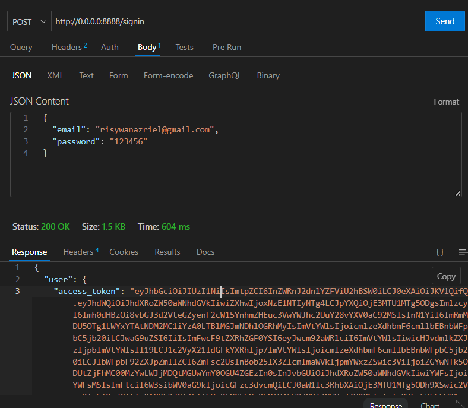
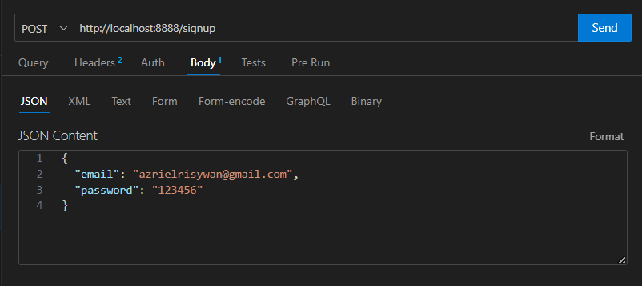
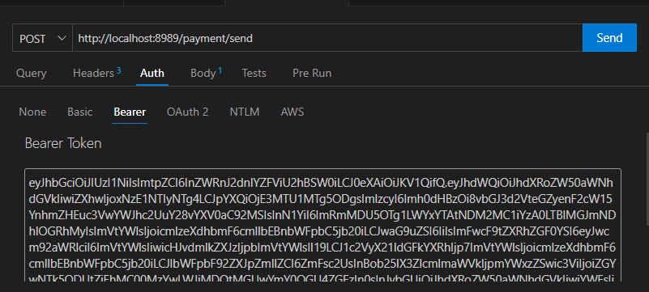
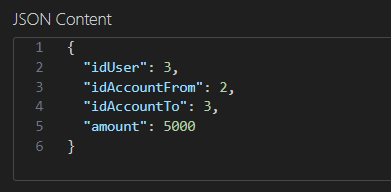
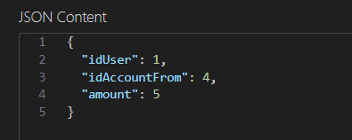
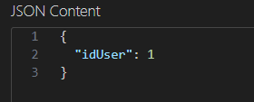
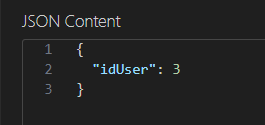

# BE-ASSIGNMENT

I've built this app using two GoLang services, containerized with Docker. PostgreSQL is utilized for data storage, hosted externally. Authentication is managed through Supabase, and Swagger is employed for API documentation.

This is a brief guide on how to install and use the app. You can see the link to API Documentation at the bottom of this readme.

## Installation

Before Installation, make sure you have Docker installed on your server/PC.

To install this BE-ASSIGNMENT, follow these steps:

1. Clone the repository:

    ```bash
    git clone https://github.com/azrielrisywan/be-assignment-user.git
    ```

2. Navigate to the project directory:

    ```bash
    cd be-assignment-user
    ```

3. Run Docker Compose:

    ```bash
    docker-compose up
    ```

## SignIn & SignUp

### Sign In (localhost:8888/signin)

Sign in with these accounts:
- Email: azrielrisywan@gmail.com, Password: 123456
- Email: risywanazriel@gmail.com, Password: 123456

Example: 


### Sign Up (localhost:8888/signup)

Sign up with your active email. The Activation link will be sent to your email after sign up.

Example:


## Main Feature

Attach `access_token` to these endpoint headers, for example:


### Send Payment (localhost:8989/payment/send)

User can send balance to another account. In my app's database, only users with id=1 and id=3 have accounts. One user can have many account types.

To send payment, hit the `/payment/send` endpoint with the following request body:


- "idUser": User ID from users
- "idAccountFrom": Source account ID
- "idAccountTo": Destination account ID
- "amount": Balance amount you want to send 

Pay attention to the amount of balance you want to send. If you don't have enough balance, the app throws an error.

### Withdraw Payment (localhost:8989/payment/withdraw)

User can withdraw balance from their account. In my app's database, only users with id=1 and id=3 have accounts. One user can have many account types.

To withdraw, hit the `/payment/withdraw` endpoint with the following request body: 



### Get Accounts By User (localhost:8888/getAccountsByUser)

Endpoint to get a list of accounts that a certain user has. This is an example of the request body:



### Get Payments List By User (localhost:8888/getPaymentsListByUser)

Endpoint to get a list of payment history that a user has. This is an example of the request body:



## API Documentation

See the API documentation (run the app first):
1. BE-USER : [http://localhost:8888/swagger/index.html](http://localhost:8888/swagger/index.html)
2. BE-PAYMENT : [http://localhost:8989/swagger/index.html](http://localhost:8989/swagger/index.html)
